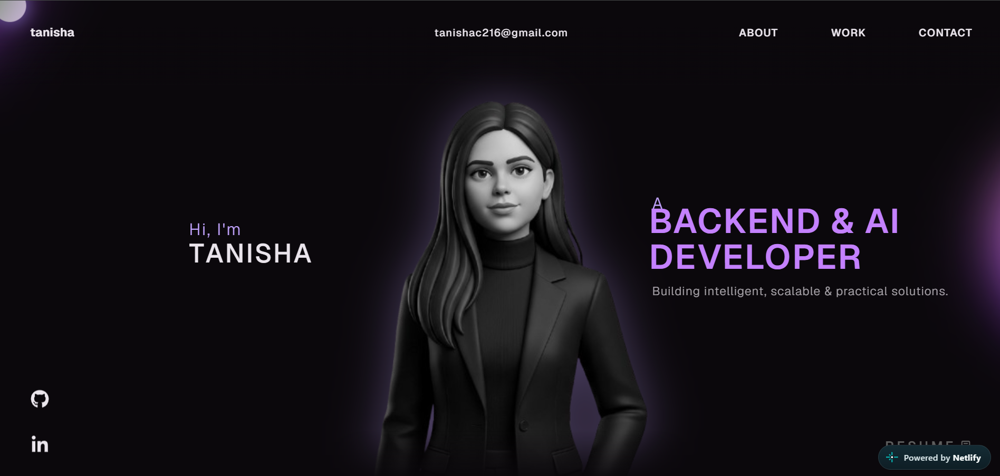

<div align="center">

# ✦ TANISHA ✦

### Backend & AI Developer

**Building intelligent, scalable & practical solutions.**

<p>
  <a href="https://10ii.netlify.app">
    
  </a>
  <a href="https://github.com/taniiishaa">
    
  </a>
  <a href="https://www.linkedin.com/in/tanisha-chaudhary-121621292">
    
  </a>
</p>

<br/>

> A little corner of the internet where I build, experiment, learn,  
> and turn ideas into real things.

<br/>

<div align="center">



</div>

</div>

---

## ✦ About The Project

This repository contains my personal developer portfolio — a place where I bring together my work, experiments, technical journey, and the things I'm currently building.

Rather than making the portfolio feel like a traditional resume website, I wanted it to feel more like **my own digital space** — interactive, visual, and still technically meaningful underneath.

The portfolio highlights my work across:

- 🤖 **Applied AI & LLM-based systems**
- ⚙️ **Backend development**
- ☁️ **Cloud & deployment**
- 🗄️ **Databases & APIs**
- 🧩 **Modern web technologies**
- 🧪 **Experiments & side projects**

The goal is simple:

**Build useful things. Understand how they work. Keep improving them.**

---

## ✨ What You'll Find Here

<table>
<tr>
<td width="50%">

### 🏠 Landing Experience

A minimal hero section introducing my current direction as a **Backend & AI Developer**, with smooth animations and an interactive visual experience.

</td>

<td width="50%">

### 👩🏻‍💻 About Me

A short look into how I approach software development, applied AI, problem solving, and learning through projects.

</td>
</tr>

<tr>
<td width="50%">

### 💼 Career

A timeline-style section covering my professional experience, internships, and technical journey.

</td>

<td width="50%">

### 🚀 Projects

Selected projects covering AI systems, resume intelligence, research assistants, APIs, and practical automation.

</td>
</tr>

<tr>
<td width="50%">

### 🧠 Tech Stack

An interactive 3D technology section showcasing the tools and technologies I work with.

</td>

<td width="50%">

### 📄 Resume

A directly accessible version of my current resume for recruiters and collaborators.

</td>
</tr>
</table>

---

# 🛠️ Tech Stack

The portfolio combines modern frontend technologies with animation and 3D rendering.

### Frontend

<p>


</p>

### Styling & Motion

<p>


</p>

### 3D & Interaction

<p>


</p>

### Development

<p>


</p>

---

# 🚀 Featured Projects

The portfolio currently highlights three projects that represent different parts of my technical journey.

---

## 01 — AI-Powered Employee Support & Decision System

> **AI • Backend • Decision Support**

An intelligent employee-support system designed to turn employee queries and organizational information into structured, useful responses and decision-support insights.

### Focus Areas

- 🤖 AI-powered assistance
- 🧠 Intelligent decision support
- ⚙️ Backend workflows
- 🔗 API-based architecture
- 📊 Structured information processing

**Built with:** Python · FastAPI · AI/LLM technologies

---

## 02 — Smart Resume Analyzer & ATS Scorer

> **NLP • Resume Intelligence • Streamlit**

A practical resume analysis application created around a problem I personally found interesting — understanding how resumes perform against ATS-style requirements.

The application analyzes resume content, extracts relevant information, evaluates skills, and presents the results in a more understandable format.

### Highlights

- 📄 Resume parsing
- 🧠 NLP-based analysis
- 🎯 ATS-oriented scoring
- 🛠️ Skill extraction
- 📊 Structured results
- 📤 JSON export

**Built with:** Python · Streamlit · NLP · spaCy

---

## 03 — Grounded Gemini Research Assistant

> **LLMs • Research • Grounded AI**

A research-focused AI assistant designed around a simple idea:

**AI responses should be grounded in the information provided to it.**

The project explores document processing, research workflows, and grounded responses using Google's Gemini ecosystem.

### Focus Areas

- 🔎 Research assistance
- 📚 Document processing
- 🤖 Gemini-powered reasoning
- 🧠 Grounded responses
- 🗂️ Context-aware workflows

**Built with:** Python · Gemini · Streamlit · AI/LLM tooling

---

# 🎨 Design Philosophy

I wanted the portfolio to feel different from a typical developer website.

Instead of filling the page with cards and text, the design focuses on:

```text
Minimal UI
     ↓
Smooth motion
     ↓
Interactive elements
     ↓
3D technology visualization
     ↓
Personal storytelling
     ↓
Technical depth
```

The visual experience is intentionally balanced with performance and usability.

---

# 🧩 Interactive Tech Stack

One of the visual highlights of the portfolio is the interactive technology section.

The technology icons are rendered as **3D spheres** using:

- Three.js
- React Three Fiber
- React Three Drei
- Rapier Physics
- React Three Postprocessing

The spheres respond to interaction and physics simulation, creating a playful way to explore the technologies I work with.

---

# 📁 Project Structure

```text
tanisha-portfolio/
│
├── public/
│   ├── images/
│   │   ├── tanisha-portrait.png
│   │   ├── ai-employee-system.png
│   │   ├── smart-resume-analyzer.png
│   │   ├── gemini-research-assistant.png
│   │   └── ...
│   │
│   ├── models/
│   └── Tanisha_Resume.pdf
│
├── src/
│   ├── components/
│   │   ├── Landing/
│   │   ├── About/
│   │   ├── Career/
│   │   ├── Work/
│   │   ├── TechStack/
│   │   └── ...
│   │
│   ├── App.tsx
│   ├── main.tsx
│   └── ...
│
├── index.html
├── package.json
├── package-lock.json
├── tsconfig.json
├── vite.config.ts
└── README.md
```
# ⚡ Run Locally

Want to explore or modify the portfolio locally?

### 1. Clone the repository

```bash
git clone https://github.com/taniiishaa/tanisha-portfolio.git
```
### 2. Move into the project

```bash
cd tanisha-portfolio
```
### 3. Install dependencies

```bash
npm install
```

### 4. Start the development server

```bash
npm run dev
```

The development server will usually be available at:

```bash
http://localhost:5173
```
### 5. Create a production build

```bash
npm run build
```
# 🌐 Deployment

The portfolio is deployed using Netlify and connected directly to GitHub.

```bash
GitHub
   │
   │ push / commit
   ▼
Netlify
   │
   │ npm run build
   ▼
Production
   │
   ▼
10ii.netlify.app
```

# 🔗 Live Website
<div align="center"> <a href="https://10ii.netlify.app">  </a> </div>

# 🔄 Continuous Deployment

Because the repository is connected to Netlify, updates can follow a simple workflow:
```bash
Edit
  ↓
Commit
  ↓
Push to GitHub
  ↓
Netlify detects changes
  ↓
Build
  ↓
Deploy
  ↓
Live 🚀
```
This makes it easy to keep the portfolio updated as I continue learning and building.

# 🧠 What I Learned

Building this portfolio wasn't just about creating a website.

It gave me hands-on experience with:

- ⚛️ React component architecture
- 📘 TypeScript
- ⚡ Vite
- 🎞️ GSAP animations
- 🌌 Three.js & React Three Fiber
- 🧲 Physics-based interaction
- 🗂️ Asset management
- 📱 Responsive design
- 🔧 Production builds
- 🌐 GitHub-based deployment
- 🚀 Netlify deployment
- 🧹 Refactoring an existing codebase
- 🎨 Balancing design with functionality

Most importantly, it taught me that building a project is only half the work — understanding, improving, and maintaining it is the other half.

# 💻 Development Philosophy

I don't want to build projects just because a technology is trending.

I like projects that start with a problem and end with something that can actually be used.

My current interests sit around:

```bash 
Backend Engineering
        +
Applied AI
        +
LLMs & Agentic Systems
        +
Cloud
        +
Practical Problem Solving
```

I'm particularly interested in building systems that connect AI with real applications, rather than keeping AI isolated inside demos.

# ✦ A Little More About Me

I'm Tanisha Chaudhary, a Computer Science undergraduate exploring the intersection of backend engineering and applied AI.

I enjoy:

- 🛠️ Building practical applications
- 🐍 Working with Python and APIs
- 🤖 Exploring AI/LLM systems
- 🔍 Understanding how systems work under the hood
- 🧩 Turning messy problems into structured solutions
- 🤝 Sharing what I learn with others

And yes — I'm still learning.

That's kind of the point. ✦

# 🤝 Connect With Me

<div align="center"> <a href="https://github.com/taniiishaa">  </a> <a href="https://www.linkedin.com/in/tanisha-chaudhary-121621292">  </a> <a href="https://10ii.netlify.app">  </a> </div>

# 🌟 Credits & Attribution

This portfolio was developed by Tanisha Chaudhary and substantially customized for my own portfolio, content, visual identity, projects, assets, and technical direction.

The project originated from an existing open-source portfolio codebase that I used as a starting point for learning and customization.

### Original Project

MoncyDev / Portfolio-Website

🔗 https://github.com/MoncyDev/Portfolio-Website

The original project's licensing and usage terms should be respected separately from my personal modifications.

<div align="center">
Built with curiosity, caffeine & a lot of debugging. ☕💻

Tanisha © 2026

<br/>

⭐ If you found something interesting here, feel free to explore the projects.

</div> 
